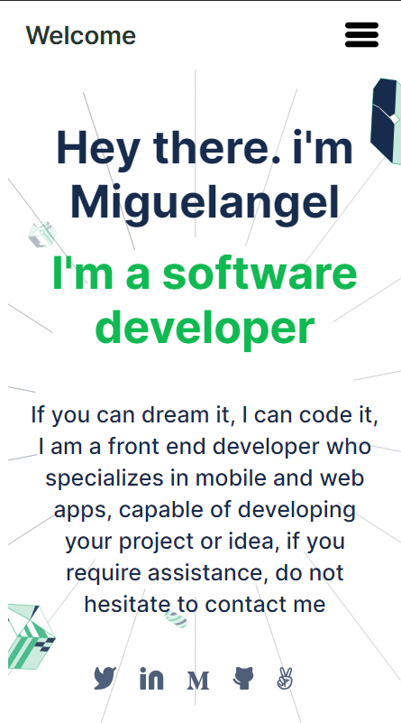

# Hello Microverse

> One paragraph statement about the project.

Additional description about the project and its features.

## Built With

- Major languages
    HTML && Css
- Frameworks
- Technologies used
    HTML && Css
## Live Demo

[Live Demo Link](https://miguelesco.github.io/portfolio/)
## Getting Started

### Usage

- Open the terminal
- Git clone <repo's link here>
- Open index.html file in the browser

## Authors

👤 **Author1**

- GitHub: [@miguelesco](https://github.com/miguelesco)
- Twitter: [@miguelescorched](https://twitter.com/miguelescorched)
- LinkedIn: [LinkedIn](https://www.linkedin.com/in/miguelangel-escorche-delgado-9a2956163/)

## 🤝 Contributing

Contributions, issues, and feature requests are welcome!

Feel free to check the [issues page](../../issues/).

## Show your support

Give a ⭐️ if you like this project!

## Acknowledgments

- Hat tip to anyone whose code was used
- Inspiration
- etc

## 📝 License

This project is [MIT](./MIT.md) licensed.
